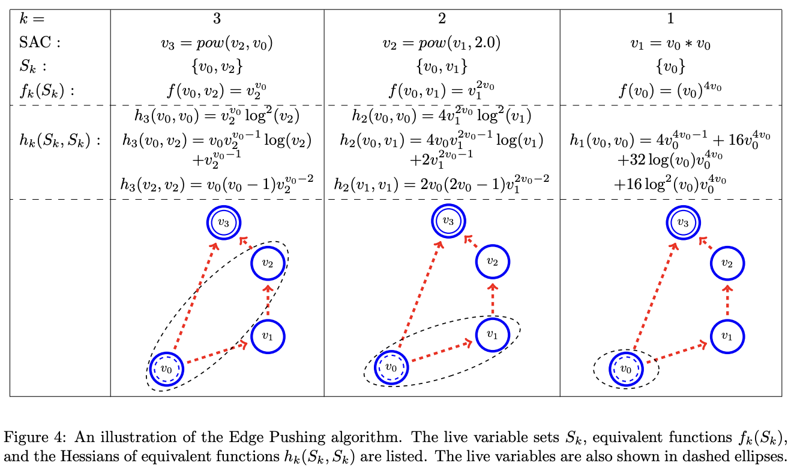

For my final project in Harvard's CS107 Systems Development course, I wrote a Python package for automatic differentiation called [graddog](https://github.com/mcembalest/graddog). It computes derivatives of numerical functions using both forward and reverse mode autodiff.

For extra credit, I implemented automatic second-order differentiation to calculate Hessians via a method called [Edge Pushing](https://par.nsf.gov/servlets/purl/10039361). The idea is to propagate second-order derivative information through the computational graph by "pushing" partial derivatives along edges.

