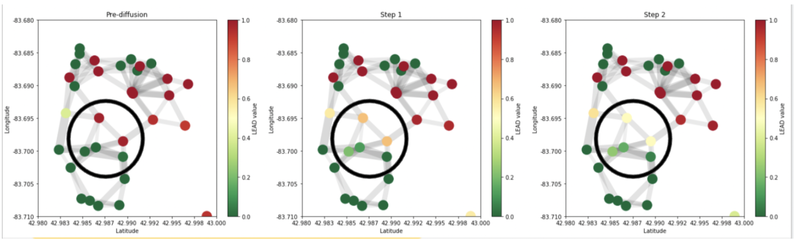
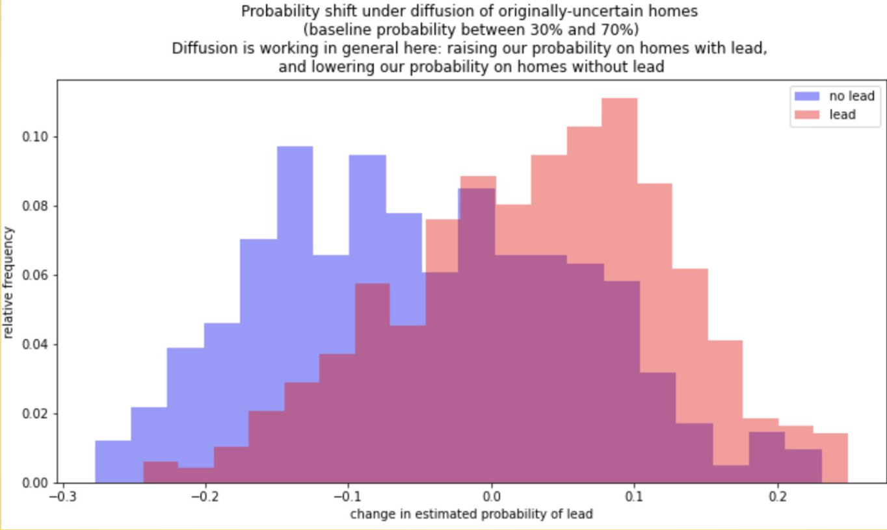
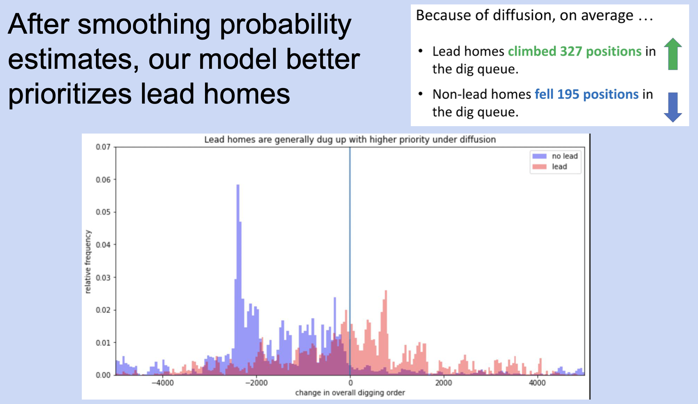

For my capstone research class during my Masters in Data Science at Harvard's Institute for Applied Computational Science, I worked with the organization [BlueConduit](https://blueconduit.com/) on a [project to improve their model's performance at identifying lead in underground pipes serving water to homes in Flint, Michigan](https://github.com/mcembalest/teamBlueConduit). They already had a well-performing XGBoost model in production, but wanted help identifying a more geospatially robust model to take advantage of the spatial nature of the problem—homes with lead in the water service line pipes tend to occur near each other.

We took the baseline XGBoost model that BlueConduit had been using in production, and applied geospatial diffusion as a post-processing module to reduce the model's overfitting of the probability each home has lead water pipes.

We conducted an assessment of our model against the baseline across the city and found that overall it performed better at prioritizing homes with lead to be dug up earlier in the digging queue than homes without lead.

