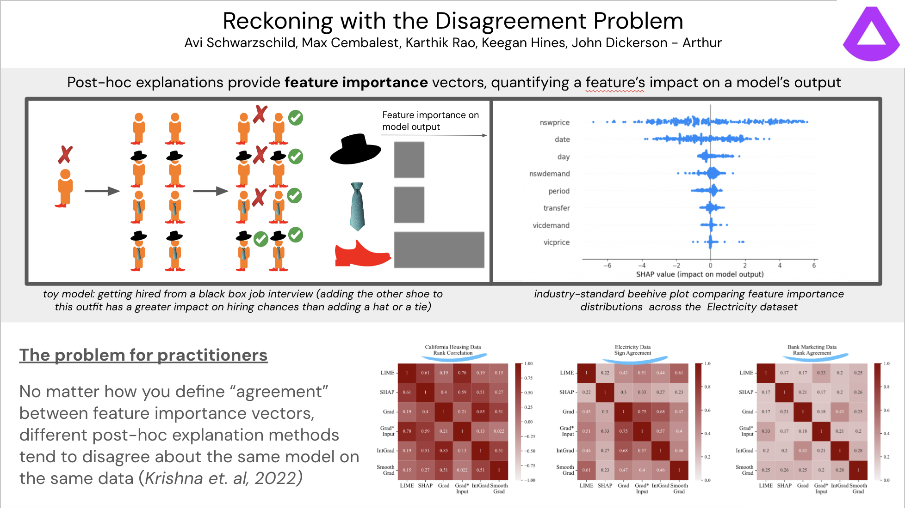
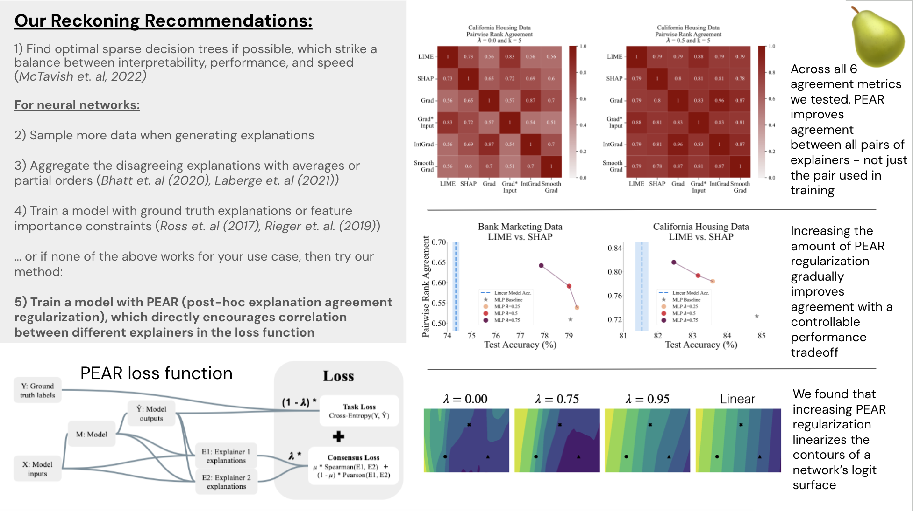

Avi Schwarzschild, **Max Cembalest**, Karthik Rao, Keegan Hines, John Dickerson. *AIES 2023.*

We formulated a new training objective to improve the consistency of neural network explanations.

The "Disagreement Problem" in explainable machine learning refers to the difficulty in getting consistent explanations of neural network behavior. My team and I developed a method that improves the consistency of neural network explanations called PEAR (Post-Hoc Explanation Agreement Regularization). You can train any PyTorch model with our regularizer by pip-installing `pear-xai` or cloning from our [GitHub repo](https://github.com/aks2203/pear-xai).

**Abstract:** As neural networks increasingly make critical decisions in high-stakes settings, monitoring and explaining their behavior in an understandable and trustworthy manner is a necessity. One commonly used type of explainer is post hoc feature attribution, a family of methods for giving each feature in an input a score corresponding to its influence on a model's output. A major limitation of this family of explainers in practice is that they can disagree on which features are more important than others. Our contribution in this paper is a method of training models with this disagreement problem in mind. We do this by introducing a Post hoc Explainer Agreement Regularization (PEAR) loss term alongside the standard term corresponding to accuracy, an additional term that measures the difference in feature attribution between a pair of explainers. We observe on three datasets that we can train a model with this loss term to improve explanation consensus on unseen data, and see improved consensus between explainers other than those used in the loss term. We examine the trade-off between improved consensus and model performance. And finally, we study the influence our method has on feature attribution explanations.

Our paper can be found on [arXiv](https://arxiv.org/abs/2303.13299). I presented our work at the 2023 AAAI/ACM Conference on Artificial Intelligence, Ethics, and Society in Montreal, and at ODSC East 2023.

