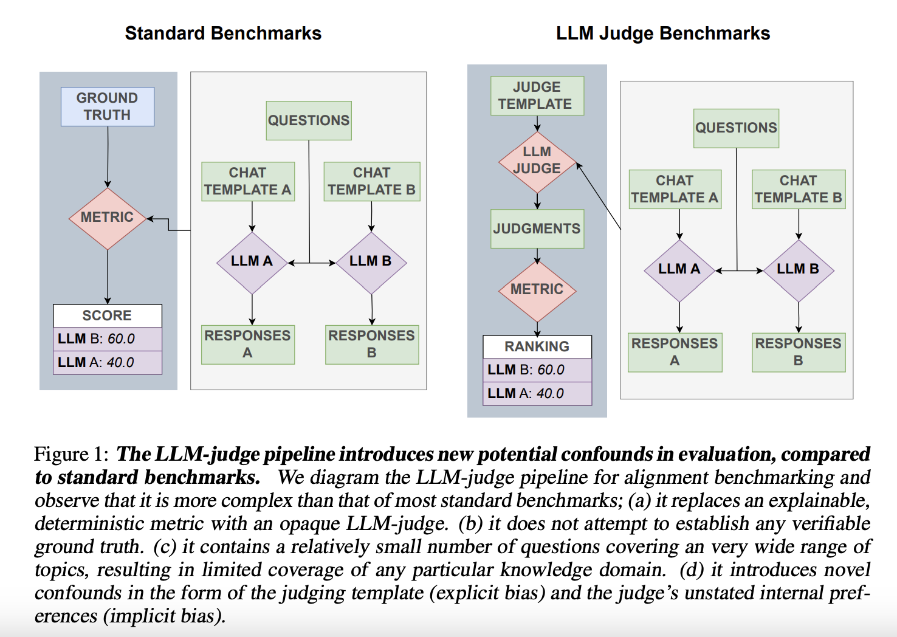

Benjamin Feuer, Micah Goldblum, Teresa Datta, Sanjana Nambiar, Raz Besaleli, Samuel Dooley, **Max Cembalest**, John P. Dickerson. *ICLR 2025.*

Published research at ICLR 2025 that critically analyzes the failure modes of using LLM-judges for AI alignment benchmarking. This work demonstrates that popular LLM-judge preferences do not correlate with concrete metrics for safety, world knowledge, or instruction following. Instead, it identifies powerful implicit biases where judges prioritize stylistic qualities over substance (i.e., factuality and safety). To address this, we introduced SOS-BENCH, a large-scale, reproducible meta-benchmark with ground truth, to provide a more reliable, concrete measure of model alignment.

**Abstract:** The release of ChatGPT in November 2022 sparked an explosion of interest in post-training and an avalanche of new preference optimization (PO) methods. These methods claim superior alignment by virtue of better correspondence with human pairwise preferences, often measured by LLM-judges. In this work, we attempt to answer the following question -- do LLM-judge preferences translate to progress on other, more concrete metrics for alignment, and if not, why not? We define a concrete metric for alignment, and introduce SOS-Bench (Substance Outweighs Style Benchmark), which is to the best of our knowledge the largest standardized, reproducible LLM meta-benchmark to date. We find that (1) LLM-judge preferences do not correlate with concrete measures of safety, world knowledge, and instruction following; (2) LLM-judges have powerful implicit biases, prioritizing style over factuality and safety; and (3) the supervised fine-tuning (SFT) stage of post-training, and not the PO stage, has the greatest impact on alignment, with data scaling and prompt diversity as the driving factors. Our codebase and complete results can be found [on GitHub](https://github.com/penfever/sos-bench).
